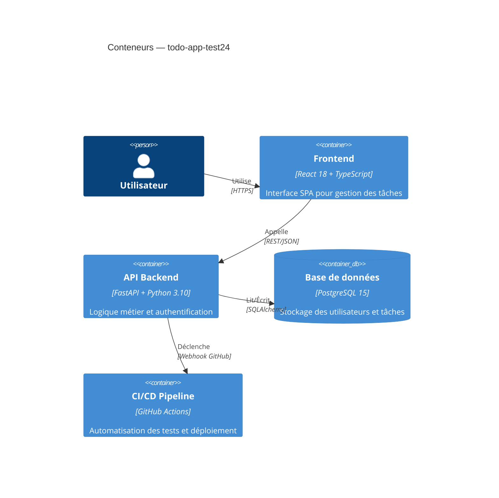

<!-- Generated by Architect Agent — C4 Model -->
<!-- https://c4model.com/ -->

# C4 Containers Diagram


```mermaid
```mermaid
C4Container
    title Conteneurs — todo-app-test24
    Person(user, "Utilisateur")
    Container(frontend, "Frontend", "React 18 + TypeScript", "Interface SPA pour gestion des tâches")
    Container(api, "API Backend", "FastAPI + Python 3.10", "Logique métier et authentification")
    ContainerDb(db, "Base de données", "PostgreSQL 15", "Stockage des utilisateurs et tâches")
    Container(ci_cd, "CI/CD Pipeline", "GitHub Actions", "Automatisation des tests et déploiement")
    Rel(user, frontend, "Utilise", "HTTPS")
    Rel(frontend, api, "Appelle", "REST/JSON")
    Rel(api, db, "Lit/Écrit", "SQLAlchemy")
    Rel(api, ci_cd, "Déclenche", "Webhook GitHub")
```
```
