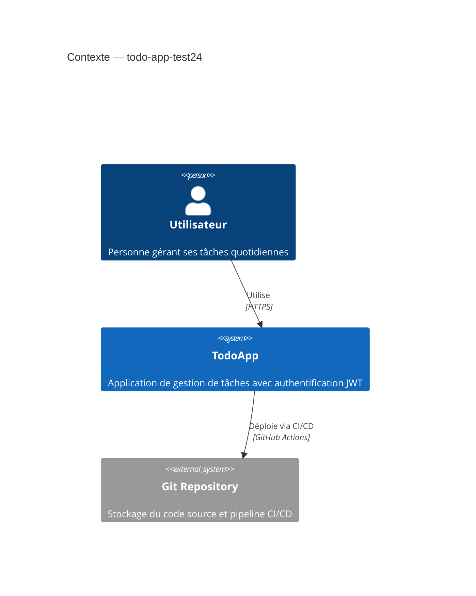

<!-- Generated by Architect Agent — C4 Model -->
<!-- https://c4model.com/ -->

# C4 Context Diagram


```mermaid
```mermaid
C4Context
    title Contexte — todo-app-test24
    Person(user, "Utilisateur", "Personne gérant ses tâches quotidiennes")
    System(api, "TodoApp", "Application de gestion de tâches avec authentification JWT")
    System_Ext(git, "Git Repository", "Stockage du code source et pipeline CI/CD")
    Rel(user, api, "Utilise", "HTTPS")
    Rel(api, git, "Déploie via CI/CD", "GitHub Actions")
```
```
