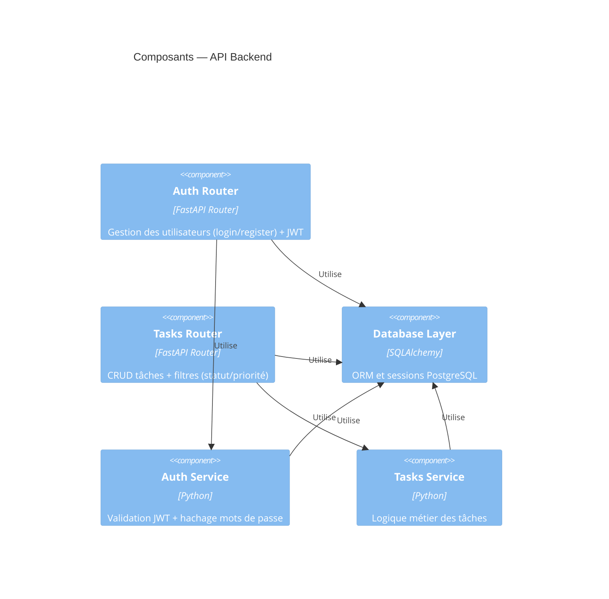

<!-- Generated by Architect Agent — C4 Model -->
<!-- https://c4model.com/ -->

# C4 Components Diagram


```mermaid
```mermaid
C4Component
    title Composants — API Backend
    Component(auth_router, "Auth Router", "FastAPI Router", "Gestion des utilisateurs (login/register) + JWT")
    Component(tasks_router, "Tasks Router", "FastAPI Router", "CRUD tâches + filtres (statut/priorité)")
    Component(db_layer, "Database Layer", "SQLAlchemy", "ORM et sessions PostgreSQL")
    Component(auth_service, "Auth Service", "Python", "Validation JWT + hachage mots de passe")
    Component(tasks_service, "Tasks Service", "Python", "Logique métier des tâches")
    Rel(auth_router, auth_service, "Utilise")
    Rel(auth_router, db_layer, "Utilise")
    Rel(tasks_router, tasks_service, "Utilise")
    Rel(tasks_router, db_layer, "Utilise")
    Rel(auth_service, db_layer, "Utilise")
    Rel(tasks_service, db_layer, "Utilise")
```
```
